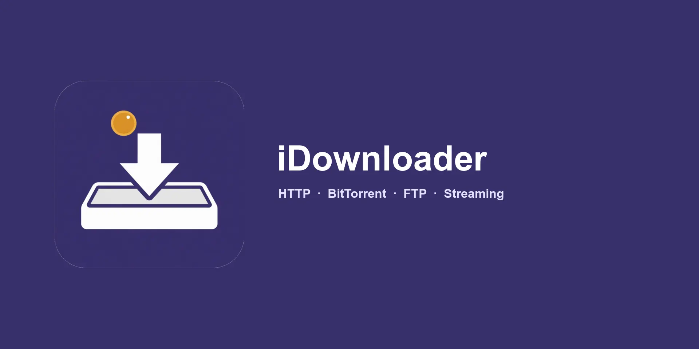

# iDownloader

A download manager for HTTP, BitTorrent, FTP, streaming media, and file hosts.
Maintained by [Subham Subhasis Patra](https://github.com/SubhamSubhasisPatra).



iDownloader runs on Windows, macOS, Linux, Android, iPhone, and iPad. The browser
extension can hand the desktop app the media on the page you are viewing.

## What it downloads

- HTTP, with segmented downloads and a shared connection pool
- Magnet links and BitTorrent
- FTP and FTPS
- HLS (M3U8) and MPEG-DASH
- eD2k
- YouTube and Bilibili, including clip selection, subtitles, and playlists
- GitHub and Hugging Face, with mirror acceleration

## Platforms

| Platform | Version | Architectures |
|:--|:--|:--|
| Windows | 10+ | x86_64, arm64 |
| macOS | 13+ | x86_64, arm64 |
| Linux | glibc 2.35+ | x86_64, arm64 |
| Android | 11+ | arm64-v8a |
| iOS / iPadOS | 16+ | arm64 |

The iPhone, iPad, and Mac Catalyst app is in [`ios/`](ios/README.md). Desktop and
Android share the Python engine.

## Browser extension

[`browser_extension/`](browser_extension/) captures media on a page and sends it to
the desktop app.

## Run the desktop app

```bash
uv sync
uv run python iDownloader.py
```

## License

iDownloader is free software under the GNU GPL v3. See [LICENSE](LICENSE).
Copyright and third-party notices are in [NOTICE.md](NOTICE.md).
